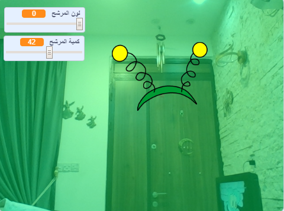

## المقدمة

ستقوم بإنشاء مشروع لإضافة فلاتر وأزياء مضحكة لصورتك على الشاشة.

### ما الذي ستصنعه

--- no-print ---

استخدم مفاتيح الأسهم لتغيير حجم الزي الخاص بك ، والأشرطة المنزلقة لتغيير تأثير المرشح. <iframe src="https://scratch.mit.edu/projects/384222996/embed" allowtransparency="true" width="485" height="402" frameborder="0" scrolling="no" allowfullscreen mark="crwd-mark"></iframe>

--- /no-print ---

--- print-only ---

--- /print-only ---

--- collapse ---
---
العنوان: ما ستحتاج إليه
---

### الأجهزة

+ كمبيوتر مزود بكاميرا ويب

### البرامج

+ برنامج Scratch 3.0 (سواء كان [عبر الإنترنت](http://rpf.io/scratchon) أو [دون اتصال بالإنترنت](http://rpf.io/scratchoff))

--- /collapse ---

--- collapse ---
---
title: ما الذي ستتعلمه
---

- كيفية التقاط (تسجيل) الفيديو في سكراتش
- كيفية تغيير تأثيرات اللون
- كيفية تغيير الأزياء بضغط المفاتيح

--- /collapse ---

--- collapse ---
---
title: معلومات إضافية للمعلمين
---

إذا كنت بحاجة إلى طباعة هذا المشروع ، فالرجاء استخدام الإصدار [الملائم للطابعة](https://projects.raspberrypi.org/ar-SA/projects/scratchchat-filters/print){:target="_blank"}.

--- /collapse ---
