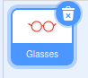

## جهز المسرح

--- task ---

افتح مشروع فارغ جديد في برنامج سكراتش.

**عبر الإنترنت:** افتح مشروع سكراتش جديد على الإنترنت على [rpf.io/scratch-new](https://rpf.io/scratch-new).

**من دون اتصال انترنيت:** افتح مشروع سكراتش Scratch جديد عبر برنامج المحرر الموجود على على جهازك دون اتصال بالانترنيت.

لتنزيل و تركيب محرر Scratch على جهازك الشخصي، يمكنك الحصول عليه من هنا [rpf.io/scratchoff](https://rpf.io/scratchoff).

--- /task ---

--- task ---

لبدء مشروعك الجديد تحتاج إلى كائن. ستستخدم الكائن لتزيين صورة نفسك. انقر على **المهملات** رمز لحذف الكائن القط الحالي.

--- /task ---

--- task ---

أنشئ كائن متحركًا جديدًا بالنقر فوق الرمز **اختر كائن متحركًا**.

--- /task ---

--- task ---

اختر زر **ازياء** واختر أحد الكائنات المتحركة. هنا سنبدأ مع النظارات.

--- /task ---

--- task ---

انقر فوق الزر **إضافة ملحق** في الزاوية السفلية اليسرى من الشاشة.

--- /task ---

--- task ---

Choose the **Video Sensing** add-on from the menu provided.

--- /task ---

--- task ---

إذا تمت مطالبتك من قبل متصفح الويب الخاص بك، ثم **السماح** من الوصول إلى كاميرا ويب الخاص بك.

--- /task ---

--- task ---

يجب أن تكون قادرًا الآن على رؤية نفسك على المسرح ، ويمكنك وضع النظارات على وجهك.

--- /task ---

