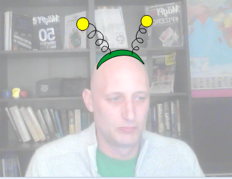

## كيفية تبديل الأزياء

--- task ---

الآن بعد أن تم وضع نظاراتك ، يمكنك استخدام بعض الضغطات على المفاتيح البسيطة لتغيير اشكالها. أضف بلوك (اللبنة) التعليمات البرمجية هذه إلى الكائن الخاص بك.

```blocks3
عند الضغط على مفتاح [السهم الأيمن v]
الزي التالي
```

--- /task ---

--- task ---

حاول الضغط على مفتاح السهم الأيمن على لوحة المفاتيح لرؤية تغيير النظارة.


--- /task ---

--- task ---

قد ترغب أيضًا في العودة إلى زي سابق باستخدام مفتاح السهم الأيسر. للقيام بذلك ، تحتاج إلى استخدام `زي رقم `{:class="block3looks"} وطرح `1` منه.

```blocks3
when [left arrow v] key pressed
switch costume to ((costume [number v]) - (1))
```

--- /task ---

--- task ---

لإضافة المزيد من الأزياء إلى الكائنات، انقر على علامة التبويب **الأزياء** ثم على الزر **اختيار زي** في الزاوية السفلية اليسرى من الشاشة.


--- /task ---

--- task ---

في علامة التبويب **المظاھر** ، يمكنك تحديد جميع أجزاء الزي عن طريق الضغط باستمرار على مفتاح Ctrl على لوحة المفاتيح ثم الضغط على مفتاح الحرف A. يمكنك بعد ذلك تحريك كل زي وتغيير حجمه حتى تكون في المكان الصحيح.



--- /task ---

--- task ---

يمكنك الآن استخدام مفاتيح الأسهم للتنقل بين جميع أزياءك المختلفة.


--- /task ---

