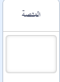
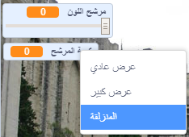

## أضف مرشح لون

الآن قم بإعطاء صورتك مرشح لون.

--- task ---

انقر فوق **الخلفية** أيقونة.



استخدم **الخلفيات** علامة التبويب إلى **تحويل إلى صورة نقطية**. ثم استخدم **دلو الطلاء** أداة لملء الخلفية بلون واحد.


--- /task ---

--- task ---

بعد ذلك، أنشئ متغيرين تسمى `مرشح اللون`{:class="block3variables"} and `كمية المشرح`{:class="block3variables"}. في الجزء الرئيسي ، يمكنك النقر بزر الماوس الأيمن على هذه المتغيرات وتعيينها (جعلها) على هيئة **منزلقات**.



--- /task ---

--- task ---

لإنهاء مشروعك ، استخدم هذه المتغيرات لتغيير مظهر المرشح.

```blocks3
when flag clicked
turn video (on v)
forever
set video transparency to (كمية المشرح)
set [color v] effect to (مرشح اللون)
```

--- /task ---

--- task ---

الآن يمكنك تحريك أشرطة التمرير لرؤية التأثير على صورتك.

--- /task ---


