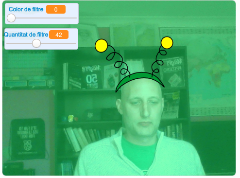

## Introducció

Vas a fer un projecte per afegir filtres i vestits ximples a la teva imatge de la pantalla.

### Què faràs

--- no-print ---

Fes servir les tecles de fletxa per canviar la mida del teu vestit i els control lliscants per canviar l'efecte de filtre. <iframe src="https://scratch.mit.edu/projects/381995604/embed" allowtransparency="true" width="485" height="402" frameborder="0" scrolling="no" allowfullscreen mark="crwd-mark"></iframe>

--- /no-print ---

--- print-only ---

--- /print-only ---

--- collapse ---
---
títol: Què necessitaràs
---

### Maquinari

+ Un ordinador amb càmera web

### Programari

+ Scratch 3.0 ( [en línia](http://rpf.io/scratchon) o [fora de línia](http://rpf.io/scratchoff))

--- /collapse ---

--- collapse ---
---
títol: Què aprendràs
---

- Com capturar vídeo a Scratch
- Com canviar els efectes de color
- Com canviar el vestit en prémer les tecles

--- /collapse ---

--- collapse ---
---
títol: Informació addicional per educadors
---

Si necessites imprimir aquest projecte, si us plau, utilitza la [versió per imprimir](https://projects.raspberrypi.org/en/projects/scratchchat-filters/print){:target="_blank"}.

--- /collapse ---
