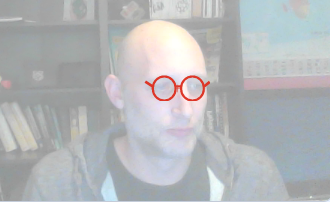

## Configura l’escenari

--- task ---

Crea un projecte nou de Scratch.

**En línia:** obre un projecte nou de Scratch en línia a [rpf.io/scratch-new](https://rpf.io/scratch-new).

**Fora de línia:** obre un projecte nou a l’editor fora de línia.

Si necessites descarregar i instal·lar l'editor fora de línia de Scratch, el pots trobar a [rpf.io/scratchoff](https://rpf.io/scratchoff).

--- /task ---

--- task ---

Per començar el teu projecte nou necessites un personatge. Utilitza el personatge per decorar la imatge de tu mateix. Fes clic a la icona **Paperera** per esborrar el personatge del gat.

--- /task ---

--- task ---

Crea un personatge nou fent clic a la icona **Tria un personatge**.

--- /task ---

--- task ---

Selecciona el botó **Moda** i tria un dels personatges. Aquí començarem amb les ulleres.

--- /task ---

--- task ---

Fes clic al botó **Afegeix una extensió** de la part inferior esquerra de la pantalla.

--- /task ---

--- task ---

Tria l'extensió **Detecció de vídeo** del menú que apareix.

--- /task ---

--- task ---

Si el navegador web pregunta, aleshores accepta **Permetre** que accedeixi a la teva càmera web.

--- /task ---

--- task ---

Ara t'hauries de veure tu mateix a l’escenari i pots situar les ulleres a la teva cara.

--- /task ---

