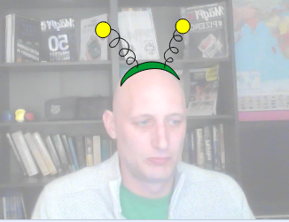

## Com canviar els vestits

--- task ---

Ara que tens les ulleres posicionades, pots fer servir algunes tecles senzilles per canviar-les d’estil. Afegeix aquests blocs de codi al teu personatge.

```blocks3
quan la tecla [fletxa dreta v] es premi
següent vestit
```

--- /task ---

--- task ---

Prova de prémer la tecla fletxa dreta del teclat per veure com les ulleres canvien d'estil.


--- /task ---

--- task ---

També és possible que vulguis tornar a un vestit anterior mitjançant la tecla de fletxa esquerra. Per fer-ho, has d'utilitzar el `número de vestit`{:class="block3looks"} i restar-ne `1`.

```blocks3
quan la tecla [fletxa dreta v] es premi
canvia el vestit a ((vestit [número v]) - (1))
```

--- /task ---

--- task ---

Per afegir més vestits al teu personatge, fes clic a la pestanya **Vestits** i, a continuació, al botó **Tria un vestit** a la part inferior esquerra de la pantalla.


--- /task ---

--- task ---

A la pestanya **Vestits**, pots seleccionar totes les parts d’un vestit mantenint premuda la tecla Ctrl del teclat i, a continuació, prem la tecla A. A continuació, pots moure i canviar la mida de cada vestit perquè estiguin al lloc correcte.



--- /task ---

--- task ---

Ara pots fer servir les tecles de fletxa per anar per tots els teus diferents vestits.


--- /task ---

