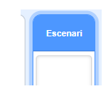
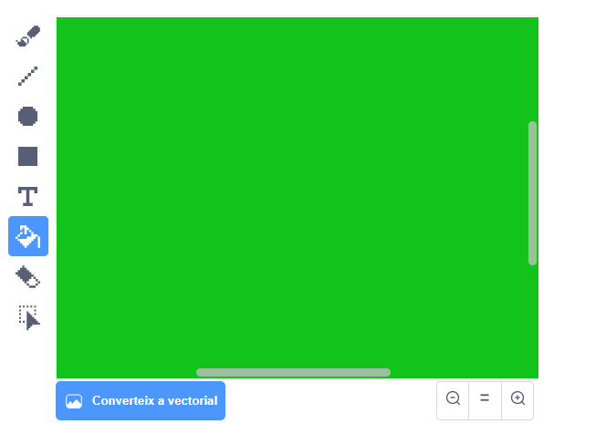
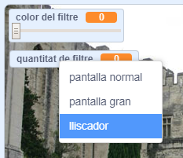

## Afegeix un filtre de color

Ara dóna a la teva imatge un filtre de color.

--- task ---

Fes clic a la icona **Fons**.



Utilitza la pestanya **Fons** i **Converteix a mapa de bits**. A continuació, utilitza l'eina de pintura **Omple** per omplir el fons amb un sol color.



--- /task ---

--- task ---

A continuació, crea dues variables anomenades `color del filtre` {:class="block3variables"} i `quantitat de filtre` {:class="block3variables"}. A l'escenari pots fer clic amb el botó dret del ratolí sobre aquestes variables i configurar-les com a **lliscadors**.



--- /task ---

--- task ---

Per finalitzar el teu projecte, utilitza aquestes variables per canviar l’aspecte del filtre.

```blocks3
quan la bandera es cliqui
posa vídeo (activa v)
per sempre
fixa la transparència del vídeo a (quantitat de filtre)
fixa l'efecte [color v] a (color del filtre)
```

--- /task ---

--- task ---

Ara pots moure els lliscadors per veure l'efecte a la teva imatge.

--- /task ---


