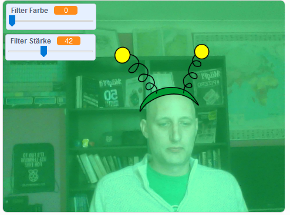

## Einleitung

Du wirst ein Projekt erstellen, um einem Bild von dir auf dem Bildschirm Filter und alberne Kostüme hinzuzufügen.

### Was du machen wirst

--- no-print ---

Benutze die Pfeiltasten, um die Größe deines Kostüms zu ändern und die Schieberegler, um den Filtereffekt zu ändern. <iframe src="https://scratch.mit.edu/projects/384619576/embed" allowtransparency="true" width="485" height="402" frameborder="0" scrolling="no" allowfullscreen mark="crwd-mark"></iframe>

--- /no-print ---

--- print-only ---

--- /print-only ---

--- collapse ---
---
title: Was du brauchen wirst
---

### Hardware

+ Ein Computer mit einer Webcam

### Software

+ Scratch 3.0 (entweder [online](http://rpf.io/scratchon) oder [offline](http://rpf.io/scratchoff))

--- /collapse ---

--- collapse ---
---
title: Was du lernen wirst
---

- Wie du in Scratch Videos aufnimmst
- Wie du Farbeffekte änderst
- Wie du Kostüme per Tastendruck wechselst

--- /collapse ---

--- collapse ---
---
title: Zusätzliche Informationen für Pädagogen
---

Wenn du dieses Projekt ausdrucken möchtest, verwende bitte die [druckerfreundliche Version](https://projects.raspberrypi.org/de-DE/projects/scratchchat-filters/print){:target="_blank"}.

--- /collapse ---
