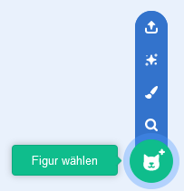
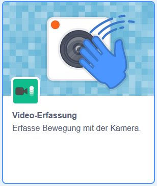
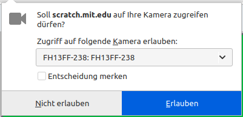

## Bühne einrichten

--- task ---

Erstelle ein neues Scratch-Projekt.

**Online:** Öffne ein neues Online-Scratch-Projekt über [rpf.io/scratch-new](https://rpf.io/scratch-new){:target="_blank.

**Offline:** Öffne ein neues Projekt im Offline-Editor.

Wenn du den Scratch-Offline-Editor herunterladen und installieren möchtest, findest du diesen unter [rpf.io/scratchoff](https://rpf.io/scratchoff).

--- /task ---

--- task ---

Um mit deinem neuen Projekt zu starten, benötigst du eine Figur. Du wirst die Figur verwenden, um das Bild von dir selbst zu dekorieren. Klicke auf das **Papierkorb**-Symbol, um die aktuelle Katzenfigur zu löschen.

--- /task ---

--- task ---

Erstelle eine neue Figur, indem du auf das **Figur wählen**-Symbol klickst.

--- /task ---

--- task ---

Wähle die Schaltfläche **Mode** und such dir eine Figur aus. Hier fangen wir mit der Brille an.

--- /task ---

--- task ---

Klicke auf die **Erweiterung hinzufügen** Schaltfläche in der unteren linken Ecke des Bildschirms.

--- /task ---

--- task ---

Wähle das Add-On **Video-Erafassung** aus dem bereitgestellten Menü.

--- /task ---

--- task ---

If you are prompted by your web browser, then **Allow** it access to your webcam.

--- /task ---

--- task ---

Du solltest dich jetzt auf der Bühne sehen und die Brille über deinem Gesicht positionieren können.

--- /task ---

