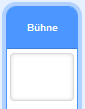
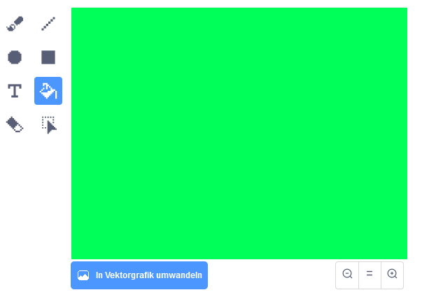
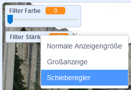

## Farbfilter hinzufügen

Now give your image a colour filter.

--- task ---

Klicke auf das **Bühnenbild**-Symbol.



Benutze die **Bühnenbilder**-Registerkarte um **in eine Vektorgrafik umzuwandeln**. Nutze dann das **Fülleimer** Werkzeug, um den Bühnenhintergrund mit einer einzigen Farbe zu füllen.



--- /task ---

--- task ---

Next, create two variables called `filter colour`{:class="block3variables"} and `filter amount`{:class="block3variables"}. Du kannst auf der Bühne, mit der rechten Maustaste auf diese Variablen klicken um sie beide **Schieberegler** sein zu lassen.



--- /task ---

--- task ---

To finish off your project, use these variables to alter the look of the filter.

```blocks3
when flag clicked
turn video (on v)
forever
set video transparency to (filter amount)
set [color v] effect to (filter colour)
```

--- /task ---

--- task ---

Du kannst jetzt die Schieberegler bewegen um den Effekt auf deinem Bild zu sehen.

--- /task ---


