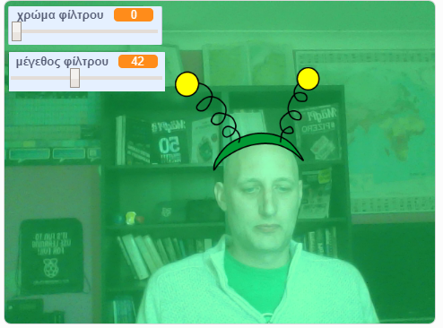

## Εισαγωγή

Πρόκειται να κάνεις ένα έργο για να προσθέσεις φίλτρα και ανόητη ενδυμασία στην εικόνα σου στην οθόνη.

### Τι θα φτιάξεις

--- no-print ---

Χρησιμοποίησε τα βελάκια για να αλλάξεις το μέγεθος της ενδυμασίας σου και τις μπάρες κύλισης για να αλλάξεις την εμφάνιση του φίλτρου. 

<iframe src="https://scratch.mit.edu/projects/384618711/embed" allowtransparency="true" width="485" height="402" frameborder="0" scrolling="no" allowfullscreen mark="crwd-mark"></iframe>

--- /no-print ---

--- print-only ---

--- /print-only ---

--- collapse ---
---
title: Τι θα χρειαστείς
---

### Υλικό

+ Ένα υπολογιστή με μια κάμερα

### Λογισμικό

+ Scratch 3.0 (είτε [σε σύνδεση](https://rpf.io/scratchon) είτε [εκτός σύνδεσης](https://rpf.io/scratchoff))

--- /collapse ---

--- collapse ---
---
title: Τι θα μάθεις
---

- Πώς να τραβάς βίντεο στο Scratch
- Πώς να αλλάξεις εφέ χρώματος
- Πώς να αλλάξεις την ενδυμασία με το πάτημα των πλήκτρων

--- /collapse ---

--- collapse ---
---
title: Πρόσθετες πληροφορίες για εκπαιδευτικούς
---

Αν χρειαστεί να εκτυπώσεις αυτό το έργο, χρησιμοποίησε την [εκτυπώσιμη έκδοση](https://projects.raspberrypi.org/el-GR/projects/scratchchat-filters/print){:target="_blank"}.

--- /collapse ---
