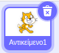

## Ρύθμισε τη σκηνή

--- task ---

Άνοιξε ένα νέο έργο Scratch.

**Σε σύνδεση:** άνοιξε ένα νέο έργο Scratch σε σύνδεση στο [rpf.io/scratch-new](https://rpf.io/scratch-new).

**Εκτός σύνδεσης:** άνοιξε ένα νέο έργο στον επεξεργαστή εκτός σύνδεσης.

Αν χρειαστεί να κατεβάσεις και να εγκαταστήσεις τον επεξεργαστή Scratch εκτός σύνδεσης, μπορείς να τον βρείς στο [rpf.io/scratchoff](https://rpf.io/scratchoff).

--- /task ---

--- task ---

Για να ξεκινήσεις το νέο έργο σου, χρειάζεσαι ένα αντικείμενο. Θα χρησιμοποιήσεις το αντικείμενο για να διακοσμήσεις την εικόνα του εαυτού σου. Κάνε κλικ στο εικονίδιο **Απορρίμματα** για να διαγράψεις το τρέχον αντικείμενο/στοιχείο της γάτας.

--- /task ---

--- task ---

Δημιούργησε ένα νέο αντικείμενο κάνοντας κλικ στο εικονίδιο **Επέλεξε ένα αντικείμενο**.

--- /task ---

--- task ---

Επέλεξε το κουμπί **Μόδα** και επέλεξε ένα από τα αντικείμενα. Εδώ θα ξεκινήσουμε με τα γυαλιά.

--- /task ---

--- task ---

Κάνε κλικ στο κουμπί **Προσθήκη επέκτασης** στην κάτω αριστερή γωνία της οθόνης.

--- /task ---

--- task ---

Επέλεξε το πρόσθετο **Βιντεοσκόπηση** από το παρεχόμενο μενού.

--- /task ---

--- task ---

Εάν σου ζητηθεί από το πρόγραμμα περιήγησης ιστού, τότε να το **Επιτρέψεις** να έχει πρόσβαση στην κάμερα web.

--- /task ---

--- task ---

Τώρα θα πρέπει να μπορείς να δεις τον εαυτό σου στη σκηνή και να τοποθετήσεις τα γυαλιά πάνω στο πρόσωπό σου.

--- /task ---

