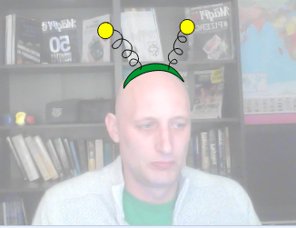

## Πώς να αλλάξεις ενδυμασίες

--- task ---

Τώρα που έχεις τοποθετήσει τα γυαλιά σου, μπορείς να πατήσεις μερικά απλά πλήκτρα για να αλλάξεις το στυλ τους. Πρόσθεσε αυτά τα μπλοκ κώδικα στο αντικείμενό σου.

```blocks3
όταν πιέσεις το πλήκτρο [δεξί βέλος v]
επόμενη ενδυμασία
```

--- /task ---

--- task ---

Δοκίμασε να πιέσεις το δεξί βέλος στο πληκτρολόγιό σου για να δεις το στυλ αλλαγής γυαλιών.


--- /task ---

--- task ---

Ίσως θέλεις επίσης να επιστρέψεις σε μια προηγούμενη ενδυμασία χρησιμοποιώντας το αριστερό βέλος. Για να γίνει αυτό θα πρέπει να χρησιμοποιήσεις τον `αριθμό ενδυμασίας`{: class = «block3looks»} και αφαιρέσεις `1` από αυτήν.

```blocks3
when [left arrow v] key pressed
switch costume to ((costume [number v]) - (1))
```

--- /task ---

--- task ---

Για να προσθέσεις επιπλέον φορεσιές στο αντικείμενο, κάνε κλικ στην καρτέλα **Ενδυμασίες** και έπειτα στο κουμπί **Επέλεξε ενδυμασία** στην κάτω αριστερή γωνία της οθόνης.


--- /task ---

--- task ---

Στην καρτέλα **Ενδυμασίες** μπορείς να επιλέξεις όλα τα μέρη μιας φορεσιάς κρατώντας πατημένο το πλήκτρο Ctrl στο πληκτρολόγιό σου και στη συνέχεια πατώντας το πλήκτρο με το γράμμα Α. Στη συνέχεια, μπορείς να μετακινήσεις και να αλλάξεις το μέγεθος σε κάθε φορεσιά ώστε να είναι στη σωστή θέση.



--- /task ---

--- task ---

Τώρα μπορείς να χρησιμοποιήσεις τα πλήκτρα με τα βέλη για να μετακινήσεις όλες τις διαφορετικές ενδυμασίες σου.


--- /task ---

