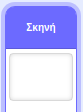
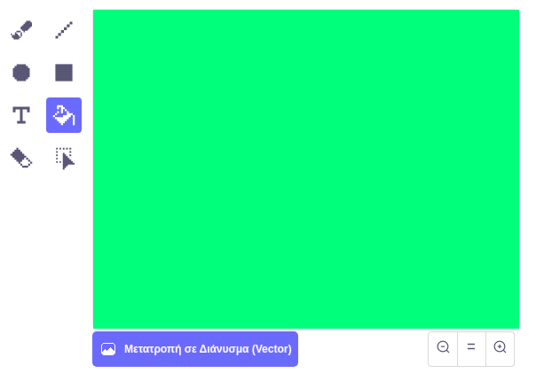
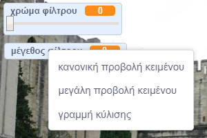

## Πρόσθεσε ένα φίλτρο χρώματος

Τώρα δώσε στην εικόνα σου ένα φίλτρο χρώματος.

--- task ---

Κάνε κλικ στο εικονίδιο **Υπόβαθρο**.



Χρησιμοποίησε την καρτέλα **Υπόβαθρο** για την **Μετατροπή σε Bitmap**. Στη συνέχεια, χρησιμοποίησε το εργαλείο **Κουβάς με χρώμα** για να γεμίσεις το φόντο με ένα μόνο χρώμα.



--- /task ---

--- task ---

Δημιούργησε δύο νέες μεταβλητές με ονόματα `χρώμα φίλτρου`{:class="block3variables"} και `μέγεθος φίλτρου`{:class="block3variables"}. Στη σκηνή μπορείς να κάνεις δεξί κλικ σε αυτές τις μεταβλητές και να ορίσεις και τις δύο να είναι **μπάρες κύλισης**.



--- /task ---

--- task ---

Για να ολοκληρώσεις το έργο σου, χρησιμοποίησε αυτές τις μεταβλητές για να αλλάξεις την εμφάνιση του φίλτρου.

```blocks3
when flag clicked
turn video (on v)
forever
set video transparency to (μέγεθος φίλτρου)
set [color v] effect to (χρώμα φίλτρου)
```

--- /task ---

--- task ---

Τώρα μπορείς να μετακινήσεις τις μπάρες κύλισης δεξιά ή αριστερά για να δεις το αποτέλεσμα στην εικόνα σου.

--- /task ---


