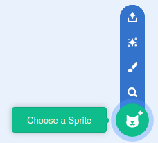
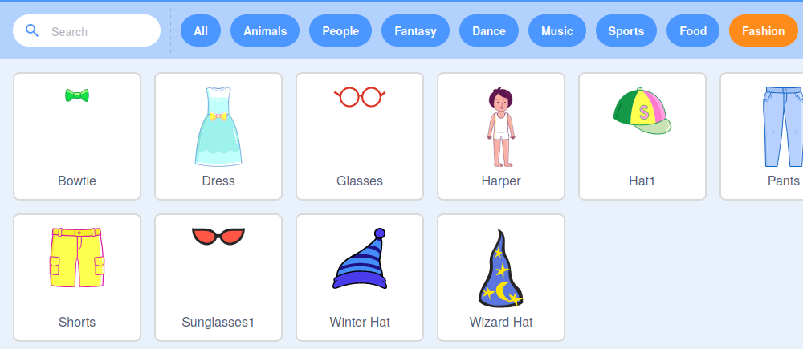

## Setting up the stage

--- task ---

To begin your new project you're going to need a sprite, that will be used to decorate the image of yourself. Delete the current Cat sprite by clicking on the `trash` icon.

--- /task ---

--- task ---

Create a new sprite by clicking on the `Choose Sprite` icon.

--- /task ---

--- task ---

Select the `Fashion` button and choose one of the sprites. Here we'll start with the glasses.

--- /task ---

--- task ---

Click on the `Add Extension` button in the bottom left of the screen.

--- /task ---

--- task ---

Choose the `Video Extension` addon from the menu provided.

--- /task ---

--- task ---

If you are prompted by you web browser, then **Allow** it access to your webcam.

--- /task ---

--- task ---

You should now be able to see yourself on the stage, and you can position the glasses over your face.

--- /task ---

