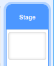

## Add a colour filter

Now give your image a colour filter.

--- task ---

Click on the **Backdrop** icon.

Now use the **Backdrops** tab to **Convert to Bitmap** and fill the backdrop with a single colour, using the **Paint bucket** tool.

--- /task ---

--- task ---

Now create two variables called `filter colour`{:class="block3variables"} and `filter amount`{:class="block3variables"}. On the stage you can right-click on these variables and set them both to be **sliders**.

--- /task ---

--- task ---

You can use these variables to alter the look of the filter to finish off your project. 

~~~blocks3
when flag clicked
turn video (on v)
forever
set video transparency to (filter amount)
set [color v] effect to (filter colour)
~~~

--- /task ---

--- task ---

Now you can move the sliders to see what effect they have on your image.

--- /task ---

