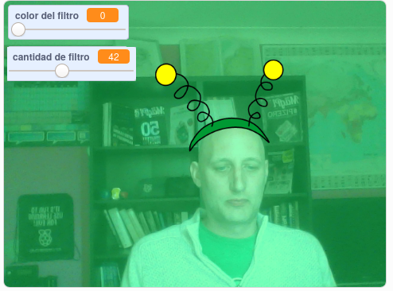

## Introducción

Vas a hacer un proyecto para añadir filtros y disfraces tontos a tu imagen en la pantalla.

### Lo que harás

--- no-print ---

Usa las teclas de dirección (teclas con las flechas) para cambiar el tamaño de tu disfraz y los controles deslizantes para cambiar el efecto del filtro. 

<iframe src="https://scratch.mit.edu/projects/384312753/embed" allowtransparency="true" width="485" height="402" frameborder="0" scrolling="no" allowfullscreen mark="crwd-mark"></iframe>

--- /no-print ---

--- print-only ---

--- /print-only ---

--- collapse ---
---
title: Lo que necesitarás
---

### Hardware

+ Un ordenador con una cámara web

### Software

+ Scratch 3.0 ([en línea](http://rpf.io/scratchon) o [sin conexión](http://rpf.io/scratchoff))

--- /collapse ---

--- collapse ---
---
title: Lo que vas a aprender
---

- Cómo capturar video en Scratch
- Cómo cambiar los efectos de color
- Cómo cambiar disfraces pulsando teclas

--- /collapse ---

--- collapse ---
---
title: Información adicional para educadores
---

Si necesitas imprimir este proyecto, usa la [versión para imprimir](https://projects.raspberrypi.org/es-ES/projects/scratchchat-filters/print){:target="_blank"}.

--- /collapse ---
