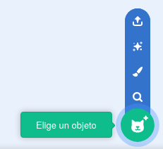
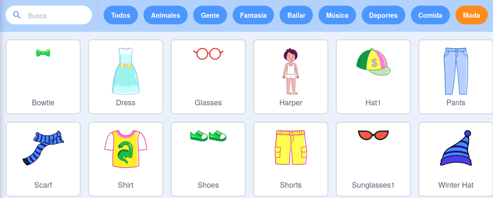
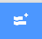
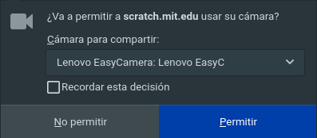

## Prepara el escenario

--- task ---

Abre un nuevo proyecto de Scratch.

**En línea:** abre un nuevo proyecto de Scratch en línea en [rpf.io/scratch-new](https://rpf.io/scratch-new).

**Sin conexión:** abre un nuevo proyecto en el editor offline (sin conexión).

Si necesitas descargar e instalar el editor de Scratch offline (sin conexión), puedes encontrarlo en [rpf.io/scratchoff](https://rpf.io/scratchoff).

--- /task ---

--- task ---

Para comenzar tu nuevo proyecto necesitas un objeto. Usarás el objeto para decorar la imagen de ti mismo. Haz clic en el icono de la **Papelera** para eliminar el objeto del gato actual.

--- /task ---

--- task ---

Crea un nuevo sprite haciendo clic en el icono **Elige un objeto**.

--- /task ---

--- task ---

Selecciona el botón **Moda** y elige uno de los objetos. Empezaremos con las gafas.

--- /task ---

--- task ---

Haz clic en el botón **Añadir Extensión** en la esquina inferior izquierda.

--- /task ---

--- task ---

Elige la extensión **Sensor de Video** del menú que aparece.

--- /task ---

--- task ---

Si tu navegador web te lo solicita, entonces **Permite** que acceda a tu cámara web.

--- /task ---

--- task ---

Ahora deberías poder verte en el escenario, y podrás colocar las gafas sobre tu cara.

--- /task ---

