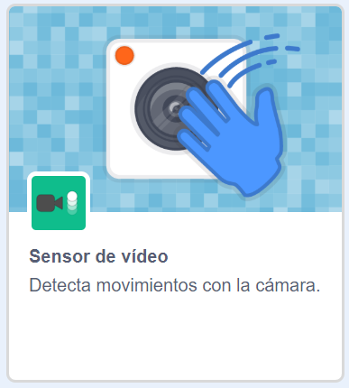

## Prepara el escenario

--- task ---

Abre un nuevo proyecto de Scratch.

**En línea:** abre un nuevo proyecto de Scratch en línea en [rpf.io/scratch-new](https://rpf.io/scratch-new).

**Sin conexión:** abre un nuevo proyecto en el editor offline (sin conexión).

Si necesitas descargar e instalar el editor de Scratch offline (sin conexión), puedes encontrarlo en [rpf.io/scratchoff](https://rpf.io/scratchoff).

--- /task ---

--- task ---

Para comenzar tu nuevo proyecto necesitas un objeto. Usarás el objeto para decorar la imagen de ti mismo. Haz clic en el icono de la **Papelera** para eliminar el objeto del gato actual.

--- /task ---

--- task ---

Create a new sprite by clicking on the **Choose a Sprite** icon.

--- /task ---

--- task ---

Select the **Fashion** button and choose one of the sprites. Here we'll start with the glasses.

--- /task ---

--- task ---

Click on the **Add Extension** button in the bottom left-hand corner of the screen.

--- /task ---

--- task ---

Choose the **Video Sensing** add-on from the menu provided.

--- /task ---

--- task ---

If you are prompted by your web browser, then **Allow** it access to your webcam.

--- /task ---

--- task ---

You should now be able to see yourself on the stage, and you can position the glasses over your face.

--- /task ---

