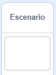
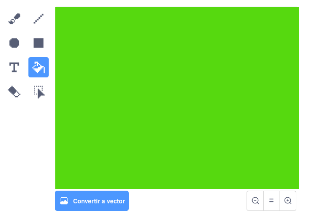
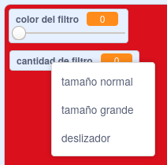

## Añade un filtro de color

Ahora añade a tu imagen un filtro de color.

--- task ---

Haz clic en el icono **Escenario**.



Usa la pestaña **Escenario** para **Convertir a mapa de bits**. Luego usa la herramienta **Rellenar** para pintar el fondo con un solo color.



--- /task ---

--- task ---

A continuación, crea dos variables llamadas `filtro de color` {:class="block3variables"} y `cantidad de filtro` {:class="block3variables"}. En el escenario puedes hacer clic con el botón derecho sobre estas variables y establecer ambas como **deslizadores**.



--- /task ---

--- task ---

Para terminar tu proyecto, utiliza estas variables para alterar el aspecto del filtro.

```blocks3
when flag clicked
turn video (on v)
forever
set video transparency to (filter amount)
set [color v] effect to (filter colour)
```

--- /task ---

--- task ---

Ahora puedes mover los deslizadores para ver el efecto sobre tu imagen.

--- /task ---


