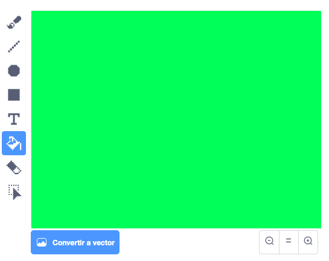

## Añade un filtro de color

Ahora dale a tu imagen un filtro de color.

--- task ---

Haz clic en el icono **Fondo**.


Usa la pestaña **Fondos** para **Convertir a mapa de bits**. Luego usa la herramienta **Cubo de pintura** para llenar el fondo con un solo color.



--- /task ---

--- task ---

Next, create two variables called `filter colour`{:class="block3variables"} and `filter amount`{:class="block3variables"}. On the stage you can right-click on these variables and set them both to be **sliders**.


--- /task ---

--- task ---

To finish off your project, use these variables to alter the look of the filter.

```blocks3
when flag clicked
turn video (on v)
forever
set video transparency to (filter amount)
set [color v] effect to (filter colour)
```

--- /task ---

--- task ---

Now you can move the sliders to see the effect on your image.

--- /task ---


