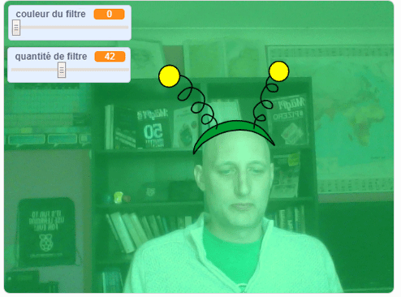

## Introduction

Tu vas faire un projet pour ajouter des filtres et des costumes idiots sur toi à l'écran.

### Ce que tu feras

--- no-print ---

Utiliser les touches fléchées pour changer la taille de ton costume et les curseurs pour changer l'effet de filtre. 

<iframe src="https://scratch.mit.edu/projects/384093522/embed" allowtransparency="true" width="485" height="402" frameborder="0" scrolling="no" allowfullscreen mark="crwd-mark"></iframe>

--- /no-print ---

--- print-only ---

--- /print-only ---

--- collapse ---
---
title: Ce que tu auras besoin
---

### Matériel informatique

+ Un ordinateur avec une webcam

### Logiciel

+ Scratch 3.0 (soit [en ligne](https://rpf.io/scratchon) ou [hors-ligne](https://rpf.io/scratchoff))

--- /collapse ---

--- collapse ---
---
title: Ce que tu vas apprendre
---

- Comment capturer une vidéo dans Scratch
- Comment changer les effets de couleur
- Comment changer de costume avec des touches

--- /collapse ---

--- collapse ---
---
title: Informations supplémentaires pour les éducateurs
---

Si vous besoin d'imprimer ce projet, utilisez la [version imprimable](https://projects.raspberrypi.org/fr-FR/projects/scratchchat-filters/print){:target="_blank"}.

--- /collapse ---
