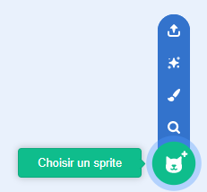

## Préparer la scène

--- task ---

Ouvre un nouveau projet Scratch.

**En ligne:** ouvre un nouveau projet Scratch en ligne sur [rpf.io/scratch-new](https://rpf.io/scratch-new).

**Hors-ligne:** ouvre un nouveau projet dans l'éditeur hors-ligne.

Si tu as besoin de télécharger et d’installer l’éditeur Scratch hors-ligne, tu peux le trouver ici: [rpf.io/scratchoff](https://rpf.io/scratchoff).

--- /task ---

--- task ---

Pour commencer ton nouveau projet, tu as besoin d'un sprite. Tu utiliseras le sprite pour décorer l'image de toi-même. Clique sur l'icône **Corbeille** pour supprimer le sprite de chat actuel.

--- /task ---

--- task ---

Crée un nouveau sprite en cliquant sur l'icône **Choisir un sprite**.

--- /task ---

--- task ---

Sélectionne le bouton **Mode** et choisis l'un des sprites. Ici, nous allons commencer avec les lunettes.

--- /task ---

--- task ---

Clique sur le bouton **Ajouter une extension** dans le coin inférieur gauche de l'écran.

--- /task ---

--- task ---

Choisis le module complémentaire **Détection vidéo** dans le menu.

--- /task ---

--- task ---

Si ton navigateur Web t'y invite, **Autorise** l'accès à ta webcam.

--- /task ---

--- task ---

Tu devrais maintenant pouvoir te voir sur la scène, et tu peux positionner les lunettes sur ton visage.

--- /task ---

