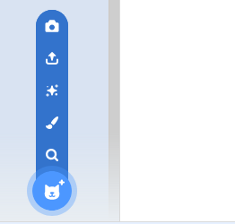

## Comment changer de costume

--- task ---

Maintenant que tes lunettes sont positionnées, tu peux utiliser de simples pressions sur les touches pour changer leur style. Ajoute ces blocs de code à ton sprite.

```blocks3
quand la touche [flèche droite v] est pressée
costume suivant
```

--- /task ---

--- task ---

Essaie d'appuyer sur la touche fléchée droite de ton clavier pour voir les lunettes changer de style.


--- /task ---

--- task ---

Tu peux également vouloir revenir à un costume précédent à l'aide de la touche fléchée gauche. Pour ce faire, tu dois utiliser le `numéro du costume`{:class="block3looks"} et en soustraire `1`.

```blocks3
when [left arrow v] key pressed
switch costume to ((costume [number v]) - (1))
```

--- /task ---

--- task ---

Pour ajouter d'autres costumes à ton sprite, clique sur l'onglet **Costumes** puis sur le bouton **Choisir un costume** dans le coin inférieur gauche de l'écran.



--- /task ---

--- task ---

Dans l'onglet **Costumes**, tu peux sélectionner toutes les parties d'un costume en maintenant enfoncée la touche Ctrl de ton clavier, puis en appuyant sur la touche A. Tu peux ensuite déplacer et redimensionner chaque costume afin qu'il soit au bon endroit.


--- /task ---

--- task ---

Maintenant, tu peux utiliser les touches fléchées pour parcourir tous tes différents costumes.


--- /task ---

