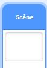
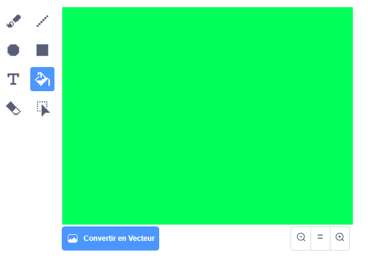
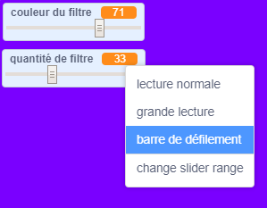

## Ajouter un filtre de couleur

Maintenant, donne à ton image un filtre de couleur.

--- task ---

Clique sur l'icone **Arrière-plan**.



Utilise l'onglet **Arrière-plan** pour **Convertir en Bitmap**. Ensuite, utilise l'outil **Pot de peinture** pour remplir l'arrière-plan d'une seule couleur.



--- /task ---

--- task ---

Ensuite, crée deux variables appelées `couleur du filtre`{:class="block3variables"} et `quantité de filtre`{:class="block3variables"}. Sur la scène, tu peux faire un clic droit sur ces variables et les définir toutes les deux comme **barres de défilement**.



--- /task ---

--- task ---

Pour terminer ton projet, utilise ces variables pour modifier l'apparence du filtre.

```blocks3
when flag clicked
turn video (on v)
forever
set video transparency to (filter amount)
set [color v] effect to (filter colour)
```

--- /task ---

--- task ---

Maintenant tu peux déplacer les curseurs pour voir l'effet sur ton image.

--- /task ---


