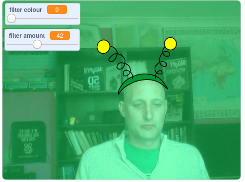

## परिचय

आप स्क्रीन पर अपनी छवि में फ़िल्टर और मज़ेदार पोशाक जोड़ने के लिए एक परियोजना बनाने जा रहे हैं।

### आप क्या बनाएँगे

--- no-print ---

अपनी पोशाक के आकार को बदलने के लिए तीर कुंजी (arrow keys) का उपयोग करें और फ़िल्टर प्रभाव को बदलने के लिए स्लाइडर्स (sliders) का उपयोग करें । 

<iframe src="https://scratch.mit.edu/projects/381995604/embed" allowtransparency="true" width="485" height="402" frameborder="0" scrolling="no" allowfullscreen mark="crwd-mark"></iframe>

--- /no-print ---

--- print-only ---

--- /print-only ---

--- collapse ---
---
title: आपको किन चीजों की आवश्यकता होगी
---

### हार्डवेयर

+ एक वेबकैम वाला कंप्यूटर

### सॉफ्टवेयर

+ Scratch 3.0 ([ऑनलाइन](https://rpf.io/scratchon) या [ऑफ़लाइन](https://rpf.io/scratchoff))

--- /collapse ---

--- collapse ---
---
title: आप क्या सीखेंगे
---

- Scratch में वीडियो कैसे कैप्चर करें
- रंग प्रभाव कैसे बदलें
- मुख्य प्रेस के साथ पोशाक कैसे बदलें

--- /collapse ---

--- collapse ---
---
title: शिक्षकों के लिए अतिरिक्त जानकारी
---

अगर आपको इस परियोजना को प्रिंट करने की आवश्यकता है तो कृप्या [प्रिंटर-अनुकूल संस्करण](https://projects.raspberrypi.org/hi-IN/projects/scratchchat-filters/print){:target="_blank"} का उपयोग करें।

--- /collapse ---
