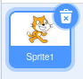
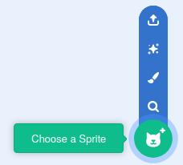

## मंच सेट करें

--- task ---

एक नई Scratch परियोजना खोलिये।

**ऑनलाइन:** [rpf.io/scratch-new](https://rpf.io/scratch-new)पर एक नई ऑनलाइन स्क्रैच परियोजना खोलें।

**ऑफ़लाइन:** ऑफ़लाइन संपादक में एक नई परियोजना खोलें।

यदि आपको स्क्रैच ऑफ़लाइन संपादक को डाउनलोड और इंस्टॉल करने की आवश्यकता है, तो आप इसे [rpf.io/scratchoff](https://rpf.io/scratchoff) {:target="_blank"} पर पा सकते हैं।

--- /task ---

--- task ---

आपको अपनी नई परियोजना शुरू करने के लिए स्प्राइट (sprite) की आवश्यकता होगी। आप ख़ुद की छवि को सजाने के लिए स्प्राइट का उपयोग करेंगे। बिल्ली स्प्राइट को हटाने के लिए **Trash** आइकन पर क्लिक करें।

--- /task ---

--- task ---

**Choose a Sprite** आइकन पर क्लिक करके एक नया स्प्राइट बनाएं।

--- /task ---

--- task ---

**Fashion** बटन चुनें और स्प्राइट्स में से किसी एक को चुनें। यहाँ हम चश्मे से शुरू करेंगे।

--- /task ---

--- task ---

स्क्रीन के निचले बाएँ कोने में **Add Extension** बटन पर क्लिक करें।

--- /task ---

--- task ---

दिए गए मेन्यू (menu) से **Video Sensing** ऐड-ऑन (add-on) चुनें।

--- /task ---

--- task ---

यदि आपको अपने वेब ब्राउज़र द्वारा संकेत दिया जाता है तो इसे अपने वेबकैम तक पहुंचने की अनुमति देने के लिए **Allow** पर क्लिक करें।

--- /task ---

--- task ---

अब आप मंच पर खुद को देख पाएंगे और अपने चेहरे पर चश्मा लगा सकते हैं।

--- /task ---

