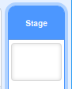
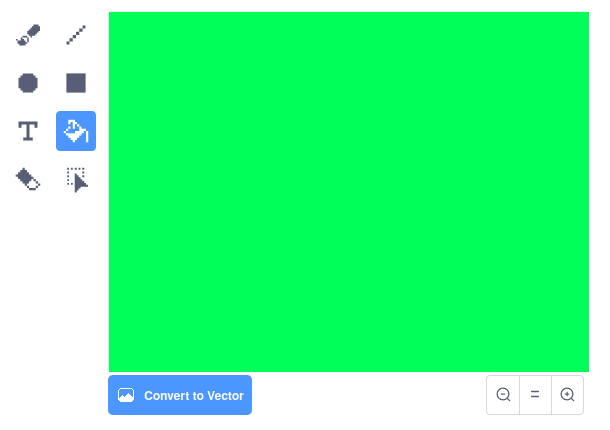
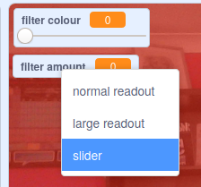

## एक रंग फिल्टर जोड़ें

अब अपनी छवि को एक रंगीन फ़िल्टर दें।

--- task ---

** Backdrop ** आइकन पर क्लिक करें।



**Convert to Bitmap** करने के लिए **Backdrops** टैब का उपयोग करें | फिर एक रंग के साथ बैकड्रॉप को भरने के लिए **Paint bucket** का उपयोग करें।



--- /task ---

--- task ---

इसके बाद `filter colour`{:class="block3variables"} और `filter amount`{:class="block3variables"} नामक दो वेरियबल (variable) बनाएं | मंच पर आप इन वेरियबल पर राइट-क्लिक कर सकते हैं और उन दोनों को **स्लाइडर्स** (sliders) के रूप में सेट कर सकते हैं |



--- /task ---

--- task ---

अपनी परियोजना को पूरा करने के लिए इन वेरियबल का उपयोग करके फ़िल्टर का रूप बदलें।

```blocks3
when flag clicked
turn video (on v)
forever
set video transparency to (filter amount)
set [color v] effect to (filter colour)
```

--- /task ---

--- task ---

अब आप अपनी छवि पर प्रभाव देखने के लिए स्लाइडर्स को बाईं या दाईं ओर ले जा सकते हैं।

--- /task ---


