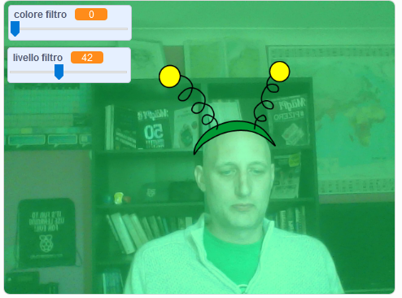

## Introduzione

Stai per creare un progetto per aggiungere filtri e costumi buffi alla tua immagine sullo schermo.

### Che cosa creerai

--- no-print ---

Usa i tasti freccia per cambiare la taglia del tuo costume e i cursori per cambiare l'effetto del filtro. <iframe src="https://scratch.mit.edu/projects/381995604/embed" allowtransparency="true" width="485" height="402" frameborder="0" scrolling="no" allowfullscreen mark="crwd-mark"></iframe>

--- /no-print ---

--- print-only ---

--- /print-only ---

--- collapse ---
---
title: Cosa ti servirà
---

### Hardware

+ Un computer con una webcam

### Software

+ Scratch 3.0 ([online](http://rpf.io/scratchon) o [offline](http://rpf.io/scratchoff))

--- /collapse ---

--- collapse ---
---
title: Cosa imparerai
---

- Come acquisire video in Scratch
- Come modificare gli effetti di colore
- Come cambiare i costumi con la pressione dei tasti

--- /collapse ---

--- collapse ---
---
title: Informazioni aggiuntive per gli educatori
---

Se intendete stampare questo progetto, fate clic su [Versione stampabile](https://projects.raspberrypi.org/en/projects/scratchchat-filters/print){:target="_blank"}.

--- /collapse ---
