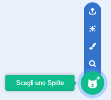
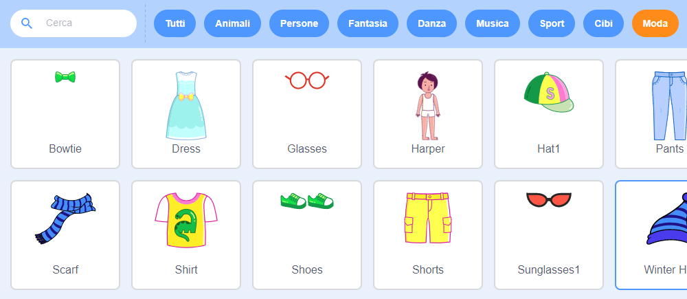
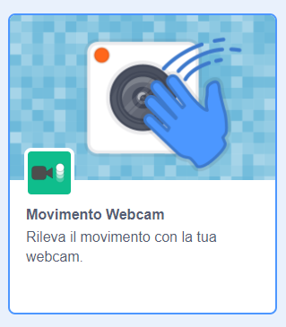
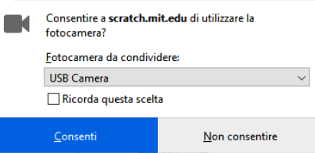

## Prepara lo stage

--- task ---

Inizia un nuovo progetto Scratch.

**Online:** apri un nuovo progetto Scratch online su [rpf.io/scratch-new](https://rpf.io/scratch-new).

**Offline:** apri un nuovo progetto nell'editor offline.

Se devi scaricare e installare l'editor offline di Scratch, puoi trovarlo all'indirizzo [rpf.io/scratchoff](https://rpf.io/scratchoff).

--- /task ---

--- task ---

Per iniziare il tuo nuovo progetto hai bisogno di uno sprite. Userai lo sprite per decorare l'immagine di te stesso. Fare clic sull'icona **Cestino** per eliminare lo sprite di gatto corrente.

--- /task ---

--- task ---

Crea un nuovo sprite facendo clic sull'icona **Scegli uno Sprite**.

--- /task ---

--- task ---

Seleziona il pulsante **Moda** e scegli uno degli sprite. Qui inizieremo con gli occhiali.

--- /task ---

--- task ---

Fai clic sul pulsante **Aggiungi estensione** nell'angolo in basso a sinistra dello schermo.

--- /task ---

--- task ---

Scegli il componente aggiuntivo **Movimento Webcam** dal menu fornito.

--- /task ---

--- task ---

Se richiesto dal browser web, **consenti** di accedere alla tua webcam.

--- /task ---

--- task ---

Ora dovresti essere in grado di vederti sullo stage e puoi posizionare gli occhiali sul tuo viso.

--- /task ---

