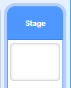
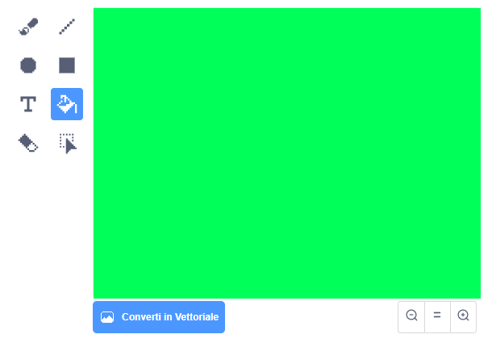
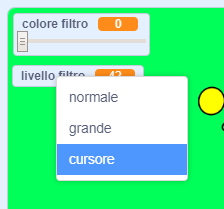

## Aggiungi un filtro colorato

Ora applica alla tua immagine un filtro colorato.

--- task ---

Fai clic sull'icona **Sfondo**.



Usa la scheda **Sfondi** per **Convertire in Bitmap**. Quindi usa lo strumento **Riempimento** per riempire lo sfondo con un colore unico.



--- /task ---

--- task ---

Quindi, crea due variabili chiamate `colore filtro`{:class="block3variables"} e `livello filtro`{:class="block3variables"}. Nello stage è possibile fare clic con il tasto destro su queste variabili e impostarle per diventare **cursori**.



--- /task ---

--- task ---

Per terminare il progetto, usa queste variabili per modificare l'aspetto del filtro.

```blocks3
when flag clicked
turn video (on v)
forever
set video transparency to (filter amount)
set [color v] effect to (filter colour)
```

--- /task ---

--- task ---

Ora puoi spostare i cursori per vedere l'effetto sulla tua immagine.

--- /task ---


