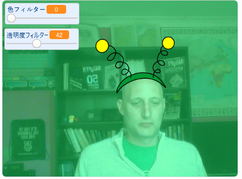

## はじめに

画面上の画像 (がぞう) にフィルターとおかしなコスチュームを追加 (ついか) するプロジェクトを作ります。

### 作るもの

--- no-print ---

矢印 (やじるし) キーを使ってコスチュームのサイズをかえ、スライダーを使ってフィルター効果 (こうか) をかえます。 <iframe src="https://scratch.mit.edu/projects/381995604/embed" allowtransparency="true" width="485" height="402" frameborder="0" scrolling="no" allowfullscreen mark="crwd-mark"></iframe>

--- /no-print ---

--- print-only ---

--- /print-only ---

--- collapse ---
---
title: 必要 (ひつよう) なもの
---

### ハードウェア

+ ウェブカメラをそなえたコンピュータ

### ソフトウェア

+ Scratch 3.0 ([オンライン](http://rpf.io/scratchon)または[オフライン](http://rpf.io/scratchoff))

--- /collapse ---

--- collapse ---
---
title: 学ぶこと
---

- How to capture video in Scratch
- How to change colour effects
- How to change costumes with key presses

--- /collapse ---

--- collapse ---
---
title: 教育者向けの追加情報
---

このプロジェクトを印刷する必要がある場合は、 [印刷用バージョン](https://projects.raspberrypi.org/en/projects/scratchchat-filters/print){:target="_ blank"}を使用してください。

--- /collapse ---
