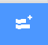

## ステージを作る

--- task ---

新しい Scratch プロジェクトを開きます。

**オンライン:** [rpf.io/scratch-new](https://rpf.io/scratch-new)から新しいオンライン Scratch プロジェクトを開きます。

**オフライン:**オフラインエディターで新しいプロジェクトを開きます。

Scratch オフラインエディターは[rpf.io/scratchoff](https://rpf.io/scratchoff)からダウンロードしてインストールできます。

--- /task ---

--- task ---

新しいプロジェクトを始めるには、スプライトが必要です。 スプライトを使って、自分の画像をかざります。 **ゴミ箱**のアイコンをクリックして、ネコのスプライトを削除 (さくじょ) します。

--- /task ---

--- task ---

**スプライトを選ぶ** (えらぶ) アイコンをクリックして、新しいスプライトを作ります。

--- /task ---

--- task ---

**ファッション** ボタンをクリックし、スプライトを1つ選びます。 ここでは、glasses (メガネ) から始めましょう。

--- /task ---

--- task ---

画面の左下すみにある **拡張機能を追加** (かくちょうきのうをついか) ボタンをクリックします。

--- /task ---

--- task ---

メニューから **ビデオモーションセンサー** アドオンを選びます。

--- /task ---

--- task ---

ウェブブラウザでダイアログが表示 (ひょうじ) された場合は、ウェブカメラへのアクセスを**許可** (きょか) します。

--- /task ---

--- task ---

これで、ステージ上で自分自身が見えるようになり、メガネを顔の上に置く (おく) ことができます。

--- /task ---

