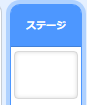
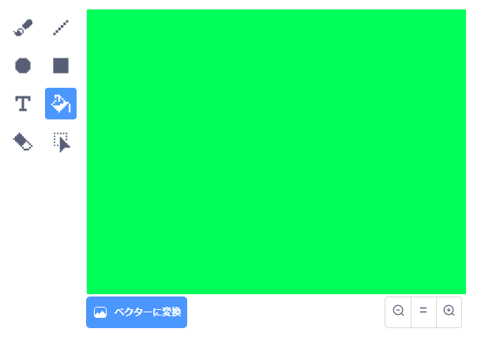
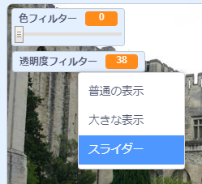

## 色フィルターを追加する

次に、画像に色フィルターを設定 (せってい) します。

--- task ---

**背景** (はいけい) アイコンをクリックします。



**背景**タブの**ビットマップに変換** (へんかん) を選びます 。 次に、**塗りつぶし** (ぬりつぶし) ツールを使って背景を一色で塗りつぶします。



--- /task ---

--- task ---

次に、`色フィルター` {:class="block3variables"}および`透明度 (とうめいど) フィルター` {:class="block3variables"}という2つの変数 (へんすう) を作ります。 ステージでこれらの変数を右クリックして、両方を**スライダー**に設定します。



--- /task ---

--- task ---

これらの変数を使用してフィルターの見た目を変え、プロジェクトを完成させます。

```blocks3
when flag clicked
turn video (on v)
forever
set video transparency to (filter amount)
set [color v] effect to (filter colour)
```

--- /task ---

--- task ---

これで、スライダーを動かして画像へのエフェクトを見ることができます。

--- /task ---


