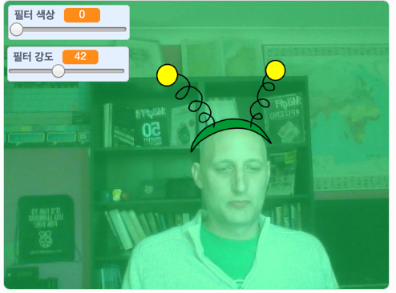

## 들어가며

화면에 있는 이미지에 필터와 우스꽝스러운 의상을 추가하는 프로젝트를 만들어 봅니다.

### 여러분이 만들 작품

--- no-print ---

화살표 키를 사용하여 의상의 크기를 변경하고 슬라이더를 사용하여 필터 효과를 변경해봅니다. 

<iframe src="https://scratch.mit.edu/projects/384705742/embed" allowtransparency="true" width="485" height="402" frameborder="0" scrolling="no" allowfullscreen mark="crwd-mark"></iframe>

--- /no-print ---

--- print-only ---

--- /print-only ---

--- collapse ---
---
title: 준비물
---

### 하드웨어

+ 웹캠이 있는 컴퓨터

### 소프트웨어

+ 스크래치 3.0 ([온라인](http://rpf.io/scratchon) 또는 [오프라인](http://rpf.io/scratchoff))

--- /collapse ---

--- collapse ---
---
title: 학습 목표
---

- 스크래치에서 비디오를 캡처하는 방법을 배웁니다.
- 색상 효과를 변경하는 방법을 배웁니다.
- 키를 눌러 의상을 바꾸는 방법을 배웁니다.

--- /collapse ---

--- collapse ---
---
title: 교육자를 위한 추가 정보
---

이 프로젝트를 인쇄하기 위해서는 [프린트용 버전](https://projects.raspberrypi.org/ko-KR/projects/scratchchat-filters/print){:target="_blank"}을 사용해 주십시오.

--- /collapse ---
