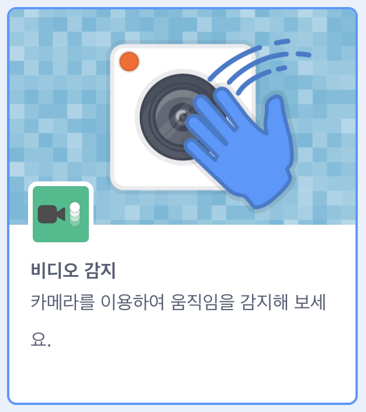

## 스테이지 설정

--- task ---

새로운 스크래치 프로젝트를 엽니다.

**온라인:** 에서 새로운 온라인 스크래치 프로젝트 [rpf.io/scratch-new](https://rpf.io/scratch-new) 열기

**오프라인:** 오프라인 편집기에서 새 프로젝트를 엽니다.

스크래치 오프라인 편집기를 설치해야 할 경우 [rpf.io/scratchoff](https://rpf.io/scratchoff)에서 다운받을 수 있습니다.

--- /task ---

--- task ---

새 프로젝트를 시작하려면 스프라이트가 필요합니다. 스프라이트를 사용하여 여러분의 이미지를 꾸며봅니다. **휴지통** 아이콘을 클릭하여 화면에 보이는 고양이 스프라이트를 삭제합니다.

--- /task ---

--- task ---

**스프라이트 선택** 아이콘을 클릭하여 새 스프라이트를 만듭니다.

--- /task ---

--- task ---

**패션** 버튼을 선택하고 스프라이트 중 하나를 선택합니다. 안경부터 시작해 보겠습니다.

--- /task ---

--- task ---

화면 왼쪽 아래에서 **추가 확장** 버튼을 클릭합니다.

--- /task ---

--- task ---

메뉴에서 **비디오 감지** 애드온을 선택합니다.

--- /task ---

--- task ---

웹 브라우저에서 팝업 창이 표시되면 브라우저에서 **웹캠에 대한 액세스를 허용**해주세요.

--- /task ---

--- task ---

이제 스테이지에 여러분의 얼굴이 보입니다. 안경을 얼굴에 놓아 볼까요.

--- /task ---

