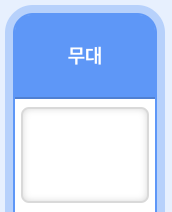
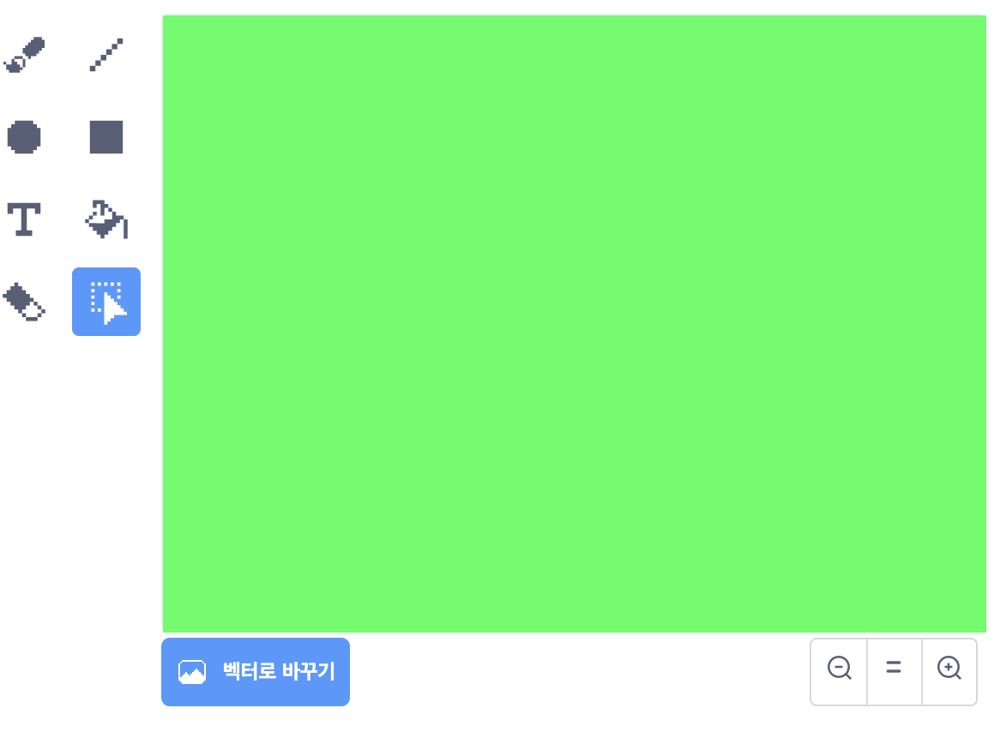
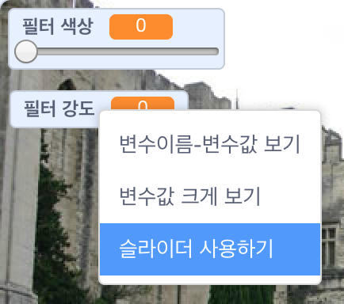

## 색상 필터 추가

이제 이미지에 색상 필터를 적용해 봅시다.

--- task ---

배경 아이콘을 클릭합니다.



**배경**탭에서 **비트맵으로 바꾸기**를 선택합니다. 그 다음 **채우기 색** 도구를 사용하여 배경을 한가지 색으로 채웁니다.



--- /task ---

--- task ---

다음으로, `필터 색상`{:class="block3variables"}과 `필터 강도`{:class="block3variables"}의 두 가지 변수를 생성합니다. 스테이지에서 이러한 변수를 마우스 오른쪽 버튼으로 클릭하고 둘 다 ** 슬라이더 사용하기**로 설정합니다.



--- /task ---

--- task ---

이 변수를 사용하여 필터 속성을 변경하기 위해 다음과 같이 설정합니다.

```blocks3
when flag clicked
turn video (on v)
forever
set video transparency to (필터 색상)
set [color v] effect to (필터 강도)
```

--- /task ---

--- task ---

이제 슬라이더를 움직이며 이미지가 어떻게 보이는지 살펴 봅니다.

--- /task ---


