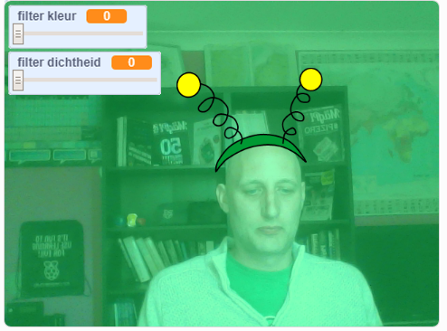

## Inleiding

Je gaat een project maken om filters en gekke uiterlijken toe te voegen aan je afbeelding op het scherm.

### Wat ga je maken

--- no-print ---

Gebruik de pijltjestoetsen om de grootte van je uiterlijk te wijzigen en de schuifregelaars om het filtereffect te wijzigen. <iframe src="https://scratch.mit.edu/projects/381995604/embed" allowtransparency="true" width="485" height="402" frameborder="0" scrolling="no" allowfullscreen mark="crwd-mark"></iframe>

--- /no-print ---

--- print-only ---

--- /print-only ---

--- collapse ---
---
title: Wat heb je nodig
---

### Hardware

+ Een computer met een webcam

### Software

+ Scratch 3.0 (of [online](http://rpf.io/scratchon) of [offline](http://rpf.io/scratchoff))

--- /collapse ---

--- collapse ---
---
title: Wat ga je leren
---

- Hoe je video kunt vastleggen in Scratch
- Hoe je Kleureffecten kunt wijzigen
- Uiterlijken veranderen met toetsaanslagen

--- /collapse ---

--- collapse ---
---
title: Aanvullende informatie voor docenten
---

Als je dit project wilt afdrukken, gebruik dan de [printvriendelijke versie](https://projects.raspberrypi.org/en/projects/scratchchat-filters/print){:target="_blank"}.

--- /collapse ---
