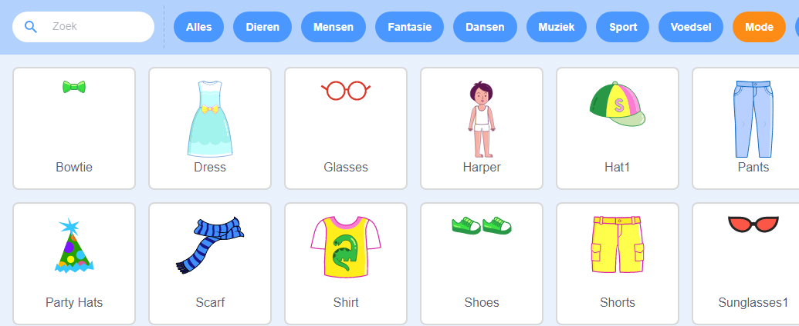

## Zet het podium op

--- task ---

Open een nieuw Scratch project.

**Online:** open een nieuw online Scratch-project op [rpf.io/scratch-new](https://rpf.io/scratch-new).

**Offline:** open een nieuw project in de offline editor.

Als je de Scratch offline editor wilt downloaden en installeren dan kan je die vinden op [rpf.io/scratchoff](https://rpf.io/scratchoff).

--- /task ---

--- task ---

Om je nieuwe project te beginnen heb je een sprite nodig. Je gebruikt de sprite om de afbeelding van jezelf te versieren. Klik op het pictogram **Prullenbak** om de huidige kat-sprite te verwijderen.

--- /task ---

--- task ---

Maak een nieuwe sprite door te klikken op het pictogram **Kies een Sprite**.

--- /task ---

--- task ---

Selecteer de **Mode** knop en kies een van de sprites. Hier beginnen we met de bril.

--- /task ---

--- task ---

Klik op de knop **Voeg een uitbreiding toe** in de linkerbenedenhoek van het scherm.

--- /task ---

--- task ---

Kies de uitbreiding **Video** in het menu.

--- /task ---

--- task ---

Als je erom wordt gevraagd door je webbrowser, geef je met **Toestaan** toegang tot je webcam.

--- /task ---

--- task ---

Je zou jezelf nu op het podium moeten kunnen zien en je kunt de bril over je gezicht plaatsen.

--- /task ---

