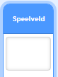
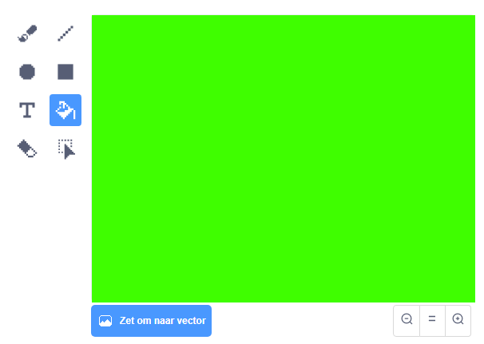
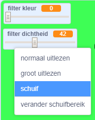

## Voeg een kleurenfilter toe

Geef nu je afbeelding een kleurenfilter.

--- task ---

Klik op **Kies een achtergrond**.



Gebruik het **Achtergronden** tabblad en klik op **Zet om naar bitmap**. Gebruik vervolgens de **Vulling** knop om de achtergrond met één kleur te vullen.



--- /task ---

--- task ---

Maak vervolgens twee variabelen aan en noem er één `filter kleur`{:class="block3variables"} en de andere `filter dichtheid`{:class="block3variables"}. In het podium kun je met de rechtermuisknop op deze variabelen klikken en ze beide instellen als **schuif**.



--- /task ---

--- task ---

Om je project af te ronden, gebruik je deze variabelen om het uiterlijk van het filter te veranderen.

```blocks3
when flag clicked
turn video (on v)
forever
set video transparency to (filter dichtheid)
set [color v] effect to (filter kleur)
```

--- /task ---

--- task ---

Nu kun je de schuiven verplaatsen om het effect op je afbeelding te zien.

--- /task ---


