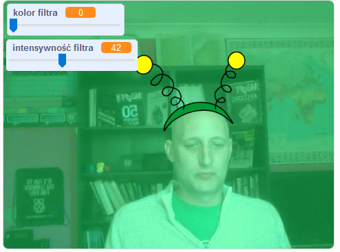

## Wprowadzenie

Będziesz tworzyć projekt dodający filtry i zabawne kostiumy do twojego obrazu na ekranie.

### Co stworzysz

--- no-print ---

Użyj klawiszy strzałek, aby zmienić rozmiar kostiumu, a suwaków, aby zmienić efekt filtra. 

<iframe src="https://scratch.mit.edu/projects/384618115/embed" allowtransparency="true" width="485" height="402" frameborder="0" scrolling="no" allowfullscreen mark="crwd-mark"></iframe>

--- /no-print ---

--- print-only ---

--- /print-only ---

--- collapse ---
---
title: Czego będziesz potrzebować
---

### Sprzęt

+ Komputer z kamerką internetową

### Oprogramowanie

+ Scratch 3 ([online](https://rpf.io/scratchon) lub [offline](https://rpf.io/scratchoff))

--- /collapse ---

--- collapse ---
---
title: Czego się nauczysz
---

- Jak przechwytywać wideo w Scratch
- Jak zmieniać efekty kolorystyczne
- Jak zmieniać kostiumy za pomocą naciśnięć klawiszy

--- /collapse ---

--- collapse ---
---
title: Dodatkowe informacje dla nauczycieli
---

Jeśli chcesz wydrukować ten projekt, użyj [wersji do druku](https://projects.raspberrypi.org/pl-PL/projects/scratchchat-filters/print){:target="_blank"}.

--- /collapse ---
