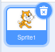
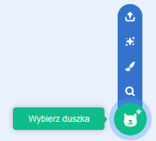
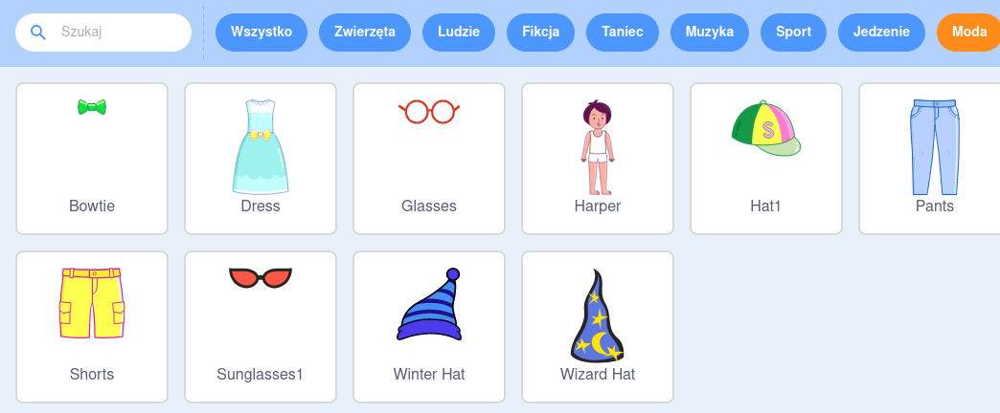
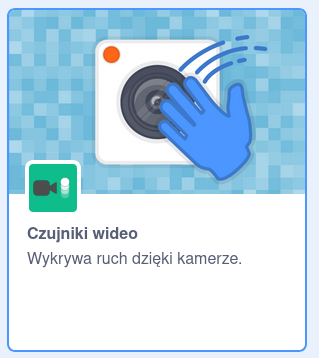
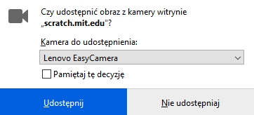
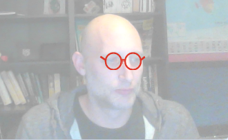

## Przygotuj scenę

--- task ---

Otwórz nowy projekt Scratch.

**Online:** otwórz nowy projekt online Scratcha pod adresem [rpf.io/scratch-new](https://rpf.io/scratch-new).

**Offline:** otwórz nowy projekt w edytorze offline.

Jeśli musisz pobrać i zainstalować edytor offline Scratcha, znajdziesz go na stronie [rpf.io/scratchoff](https://rpf.io/scratchoff).

--- /task ---

--- task ---

Aby rozpocząć nowy projekt, potrzebujesz duszka. Użyjesz go, aby przyozdobić nim swój wizerunek. Kliknij ikonę **Kosza** aby usunąć duszka kota.

--- /task ---

--- task ---

Utwórz nowego duszka, klikając ikonę **Wybierz duszka**.

--- /task ---

--- task ---

Naciśnij przycisk **Moda** i wybierz jednego z duszków. W tym projekcie będziemy używać duszka okularów.

--- /task ---

--- task ---

Kliknij przycisk **Dodaj rozszerzenie** w lewym dolnym rogu ekranu.

--- /task ---

--- task ---

Wybierz dodatek **Czujniki wideo** z dostępnego menu.

--- /task ---

--- task ---

Jeśli wyświetli się prośba o przyznanie uprawnień do obrazu z kamerki internetowej, naciśnij przycisk **Udostępnij**.

--- /task ---

--- task ---

Teraz na scenie powinna pojawić się Twoja twarz. Możesz umieścić na niej okulary.

--- /task ---

