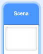
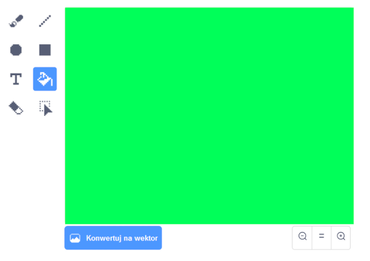
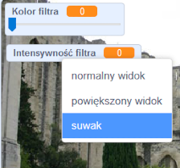

## Dodaj filtr koloru

Teraz dodaj do swojego obrazka kolorowy filtr.

--- task ---

Naciśnij ikonę **Scena**.



Wejdź w zakładkę **Tła** i naciśnij przycisk **Przekształć w bitmapę**. Potem użyj narzędzia **Wypełnij**, aby pomalować tło jednym kolorem.



--- /task ---

--- task ---

Następnie stwórz dwie zmienne, które nazwiesz `Kolor filtra`{:class="block3variables"} i `Intensywność filtra`{:class="block3variables"}. Kliknij prawym przyciskiem myszy na zmienne, które właśnie pojawiły się na scenie i z rozwijanego menu wybierz opcję **suwak**.



--- /task ---

--- task ---

Aby dokończyć swój projekt, użyj tych zmiennych, by wpływać na efekt użytego filtra.

```blocks3
when flag clicked
turn video (on v)
forever
set video transparency to (filter amount)
set [color v] effect to (filter colour)
```

--- /task ---

--- task ---

Teraz możesz przesuwać suwaki i obserwować zmiany na twoim obrazku.

--- /task ---


