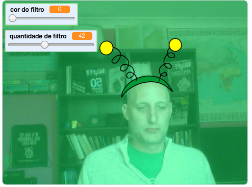

## Introdução

Você vai fazer um projeto para adicionar filtros e fantasias bobas à sua imagem na tela.

### O que você vai fazer

--- no-print ---

Use as setas do teclado para alterar o tamanho da sua fantasia e os controles deslizantes para alterar o efeito do filtro. 

<iframe src="https://scratch.mit.edu/projects/384707438/embed" allowtransparency="true" width="485" height="402" frameborder="0" scrolling="no" allowfullscreen mark="crwd-mark"></iframe>

--- /no-print ---

--- print-only ---

--- /print-only ---

--- collapse ---
---
title: O que você vai precisar
---

### Hardware

+ Um computador com uma webcam

### Software

+ Scratch 3.0 ([online](https://rpf.io/scratchon) ou [off-line](https://rpf.io/scratchoff))

--- /collapse ---

--- collapse ---
---
title: O que você vai aprender
---

- Como capturar vídeo no Scratch
- Como alterar efeitos de cores
- Como mudar de fantasia pressionando teclas

--- /collapse ---

--- collapse ---
---
title: Informações adicionais para educadores
---

Se você precisar imprimir este projeto, por favor use a [versão para impressão](https://projects.raspberrypi.org/pt-BR/projects/scratchchat-filters/print){:target="_blank"}.

--- /collapse ---
