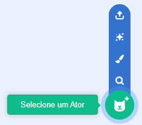
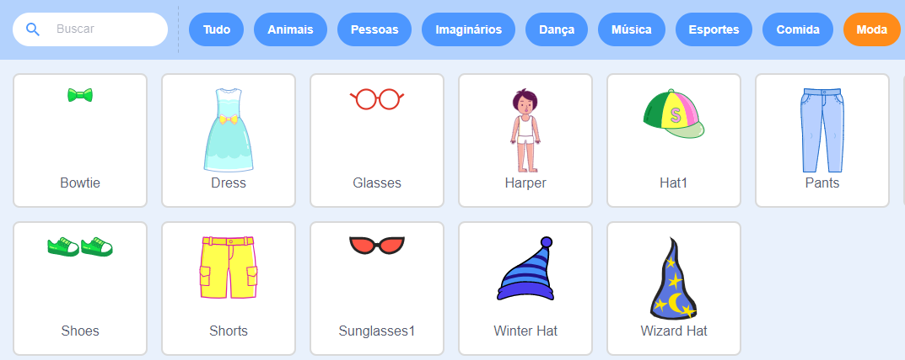
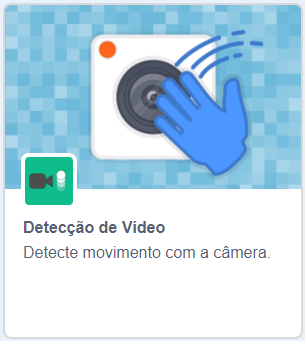
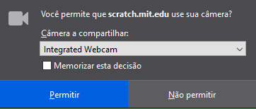

## Preparar o palco

--- task ---

Abra um novo projeto Scratch.

**Online:** abra um novo projeto Scratch online em [rpf.io/scratch-new](https://rpf.io/scratch-new).

**Offline:** abra um novo projeto no editor offline.

Se você precisa baixar e instalar o editor do Scratch offline, você pode encontrá-lo em [rpf.io/scratchoff](https://rpf.io/scratchoff).

--- /task ---

--- task ---

Para iniciar seu novo projeto, você precisa de um ator. Você usará o ator para decorar a imagem de você mesmo. Clique no ícone **Lixeira** para excluir o ator gato atual.

--- /task ---

--- task ---

Crie um novo ator clicando no ícone **Selecione um Ator**.

--- /task ---

--- task ---

Selecione o botão **Moda** e escolha um dos atores. Here we'll start with the glasses.

--- /task ---

--- task ---

Clique no botão **Adicionar uma Extensão** no canto inferior esquerdo da tela.

--- /task ---

--- task ---

Escolha o extensão **Detecção de Vídeo** no menu fornecido.

--- /task ---

--- task ---

Se você for solicitado pelo seu navegador da web, **Permitir** que acesse sua webcam.

--- /task ---

--- task ---

Agora você deve ser capaz de se ver no palco, e você pode posicionar os óculos sobre o seu rosto.

--- /task ---

