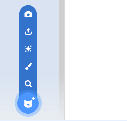

## Como trocar de fantasias

--- task ---

Agora que você tem seus óculos posicionados, você pode usar algumas teclas para mudar seu estilo. Adicione esses blocos de código ao seu ator.

```blocks3
quando a tecla [seta para direita v] for pressionada
próxima fantasia
```

--- /task ---

--- task ---

Tente pressionar a tecla seta para direita do teclado para ver os óculos mudarem de estilo.


--- /task ---

--- task ---

Você também pode querer voltar para uma fantasia anterior usando a tecla de seta esquerda. Para fazer isso, você precisa usar o `número da fantasia`{:class="block3looks"} e subtrair `1` dele.

```blocks3
quando [seta para esquerda v] for clicado
mude para a fantasia((fantasia [número v]) (- 1))
```

--- /task ---

--- task ---

Para adicionar mais algumas fantasias ao seu ator, clique na aba **Fantasias** e, em seguida no botão **Escolher Fantasia** no canto inferior esquerdo da tela.



--- /task ---

--- task ---

Na aba **Fantasias**, você pode selecionar todas as partes de uma fantasia mantendo pressionada a tecla Ctrl do teclado e pressionando a tecla da letra A. Você pode então mover e redimensionar cada fantasia para que eles estejam no lugar correto.


--- /task ---

--- task ---

Agora você pode usar as setas do teclado para percorrer todas as suas diferentes fantasias.


--- /task ---

