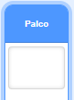
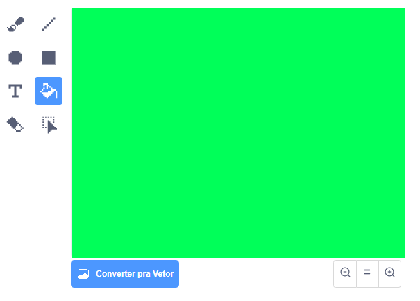
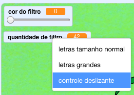

## Adicionar um filtro de cores

Agora dê um filtro de cores à sua imagem.

--- task ---

Clique no ícone **Cenário**.



Use a aba **Cenários** para **Converter para Bitmap**. Em seguida, use a ferramenta **Preencher** para preencher o cenário com uma única cor.



--- /task ---

--- task ---

Em seguida, crie duas variáveis chamadas `cor do filtro`{:class="block3variables"} e `quantidade de filtro`{:class="block3variables"}. No palco, você pode clicar com o botão direito do mouse nessas variáveis e configurá-las para serem **controles deslizantes**.



--- /task ---

--- task ---

Para terminar seu projeto, use estas variáveis para alterar a aparência do filtro.

```blocks3
when flag clicked
turn video (on v)
forever
set video transparency to (quantidade de filtro)
set [color v] effect to (cor do filtro)
```

--- /task ---

--- task ---

Agora você pode mover os controles deslizantes para ver o efeito em sua imagem.

--- /task ---


