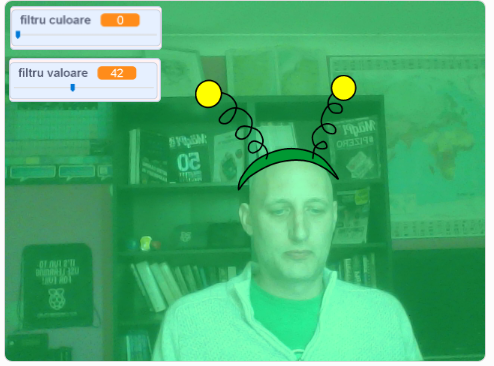

## Introducere

Vei face un proiect pentru a adăuga filtre și costume haioase la imaginea ta pe ecran.

### Ce vei face

--- no-print ---

Folosește tastele săgeată pentru a schimba dimensiunea costumului și cursoarele pentru a schimba efectul filtrului. 

<iframe src="https://scratch.mit.edu/projects/384707698/embed" allowtransparency="true" width="485" height="402" frameborder="0" scrolling="no" allowfullscreen mark="crwd-mark"></iframe>

--- /no-print ---

--- print-only ---

--- /print-only ---

--- collapse ---
---
title: De ce vei avea nevoie
---

### Hardware

+ Un computer cu o cameră web

### Software

+ Scratch 3.0 (fie [online](https://rpf.io/scratchon) sau [offline](https://rpf.io/scratchoff))

--- /collapse ---

--- collapse ---
---
title: Ce vei învăța
---

- Cum să capturezi videoclipuri în Scratch
- Cum să modifici efectele de culoare
- Cum se schimbă costumele din tastatură

--- /collapse ---

--- collapse ---
---
title: Informații suplimentare pentru educatori
---

Dacă trebuie să printezi acest proiect, folosește [versiunea printabilă](https://projects.raspberrypi.org/ro-RO/projects/scratchchat-filters/print){:target="_blank"}.

--- /collapse ---
