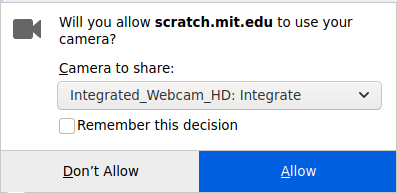

## Configurează scena

--- task ---

Deschide un nou proiect Scratch.

**Online:** deschide un proiect Scratch nou în [rpf.io/scratch-new](https://rpf.io/scratch-new).

**Offline:** deschide un proiect nou în editorul offline.

Dacă ai nevoie să descarci și să instalezi editorul offline Scratch, îl poți găsi la [rpf.io/scratchoff](https://rpf.io/scratchoff).

--- /task ---

--- task ---

Pentru a începe noul tău proiect, ai nevoie de un personaj. Vei folosi personajul pentru a decora imaginea ta. Dă click pe pictograma **Coș de gunoi** pentru a șterge personajul curent pisică.

--- /task ---

--- task ---

Creează un personaj nou dând click pe pictograma **Alege un personaj**.

--- /task ---

--- task ---

Selectează butonul **Modă** și alege unul dintre personaje. Aici vom începe cu ochelarii.

--- /task ---

--- task ---

Dă click pe butonul **Adaugă o extensie** din colțul din stânga jos al ecranului.

--- /task ---

--- task ---

Alege suplimentul **Detectare video** din meniul oferit.

--- /task ---

--- task ---

Dacă ți se solicită de către navigatorul web, atunci **Permite** accesul la camera ta web.

--- /task ---

--- task ---

Acuma ar trebui să te poți vedea pe scenă și să poți poziționa ochelarii deasupra feței.

--- /task ---

